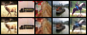

# CIFAR10 AutoEncoder

## Introduction

This project focuses on implementing an AutoEncoder neural network for image compression and reconstruction using the CIFAR10 dataset. The primary goal is to learn efficient data codings in an unsupervised manner.

## Model Architecture

The AutoEncoder consists of an encoder and a decoder. The encoder compresses the input image into a latent space representation, and the decoder reconstructs the image from this representation.

### Encoder

- The encoder network compresses a 3-channel image down to a 1-dimensional latent vector.
- It consists of several convolutional layers, each followed by batch normalization and LeakyReLU activation.
- Originally, the encoder compressed the image to a size of [128, 2, 2].

### Decoder

- The decoder network performs the reverse operation of the encoder, reconstructing the image from the latent vector.
- Similar to the encoder, it consists of convolutional layers with batch normalization and LeakyReLU activation.

### Recent Improvements

- To achieve the final objective of compressing the image to a 1-dimensional vector, three additional layers were added to both the encoder and the decoder.
- For those interested in enhanced performance with a 2-dimensional latent space ([128, 2, 2]), the following three lines in both the encoder and decoder can be commented out:
  ```python
  nn.LeakyReLU(0.2, inplace=True),
  nn.Conv2d(128, latent_size, 2),  # [latent_size, 1, 1]
  nn.LeakyReLU(0.2, inplace=True),
  ```
  And in the decoder:
  ```python
  nn.ConvTranspose2d(latent_size, 128, 2),  # [128, 2, 2]
  nn.LeakyReLU(0.2, inplace=True),
  nn.BatchNorm2d(128),
  ```

## Setup and Usage

1. **Installation**
   Clone the repository and install the necessary packages.

   ```bash
   git clone https://github.com/daehwa00/CIFAR10_AutoEncoder
   cd CIFAR10-AutoEncoder
   pip install -r requirements.txt
   ```

2. **Training the Model**
   Run the training script with optional command line arguments for batch size and using a pre-trained model.

   ```bash
   python main.py --batch_size 2000 --use_pretrained
   ```

3. **Visualizing Results**
   The trained model's performance can be visualized using the `visualize_results` function, which saves the original and reconstructed images side by side.

## Contributing

Contributions to improve the model or the training process are welcome. Please feel free to submit pull requests or open issues to discuss potential improvements.

## Result

- Training for 500 epochs
- Final L2 loss: 0.0028

<p align="center">
  
</p>


## License

[MIT License](LICENSE)

---

### CIFAR10-AutoEncoder README

#### 개요

이 프로젝트는 CIFAR10 데이터셋을 사용하여 이미지의 특징을 학습하는 AutoEncoder 모델을 구현합니다. 모델은 이미지를 저차원의 잠재 공간(latent space)으로 인코딩한 후, 다시 원본 이미지로 디코딩하는 과정을 통해 이미지의 핵심적인 특징을 추출하고 학습합니다.

#### 모델 구조

모델은 인코더와 디코더로 구성되어 있습니다. 인코더는 입력 이미지를 점차적으로 저차원의 표현으로 압축하고, 디코더는 이 저차원 표현을 다시 원본 이미지의 차원으로 복원합니다.

인코더의 마지막 레이어는 이미지를 1차원 벡터로 변환하는 것을 목표로 하지만, 성능 향상을 위해 `[128, 2, 2]` 크기까지만 압축하는 것이 더 효과적이라는 것을 발견했습니다. 따라서 인코더의 마지막 3줄과 디코더의 첫 3줄은 이러한 목표를 달성하기 위해 추가되었습니다:

```python
# Encoder
nn.LeakyReLU(0.2, inplace=True),
nn.Conv2d(128, latent_size, 2),  # [latent_size, 1, 1]
nn.LeakyReLU(0.2, inplace=True),
```

```python
# Decoder
nn.ConvTranspose2d(latent_size, 128, 2),  # [128, 2, 2]
nn.LeakyReLU(0.2, inplace=True),
nn.BatchNorm2d(128),
```

성능을 더 높이고 싶다면, 위의 각 3줄을 주석 처리하여 사용할 수 있습니다.
